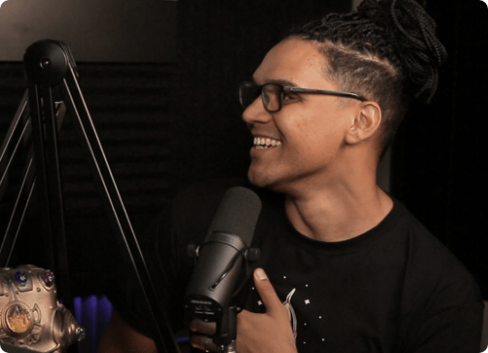

<h1 align="center">
    
</h1>   
 

## ℹ Sobre

O LaunchBase é um treinamento no formato de bootcamp online que tem duração de 8 semanas. A cada semana os conteúdos são liberados de acordo com um cronograma, guiando o aluno pelas ferramentas e conceitos mais modernos de desenvolvimento web para entrar com o pé direito nesse universo e ir direto ao ponto naquilo que realmente importa para alcançar seus maiores objetivos como dev.

## Quem é o piloto?

### Mayk Brito

Instrutor do LaunchBase

Programador há 12 anos e instrutor na Rocketseat, apaixonado por ajudar quem está iniciando no mundo da programação.

Já treinou diretamente 1.288 alunos nas ferramentas mais modernas de desenvolvimento web, e ajudou cada um deles a acelerar sua evolução na primeira etapa da carreira.

 

## 🚀 Tecnologias utilizadas:

- css
- Html
- Javascript
- Node.js

 

💬 Vamos trocar ideias 
------------------
[*Entre em contato comigo*](https://www.linkedin.com/in/ivo-pereira-3997911a8/)

Obrigado por chegar até aqui!

