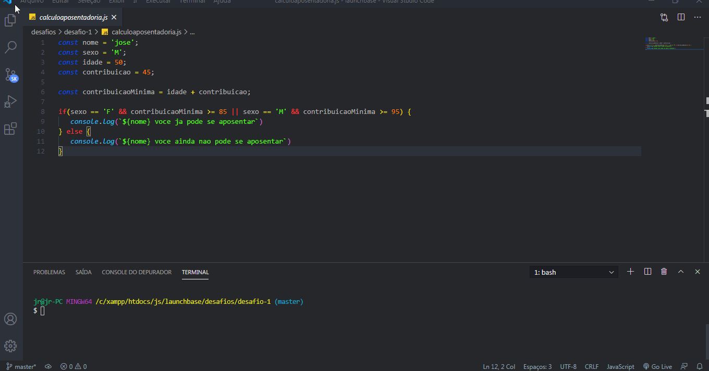
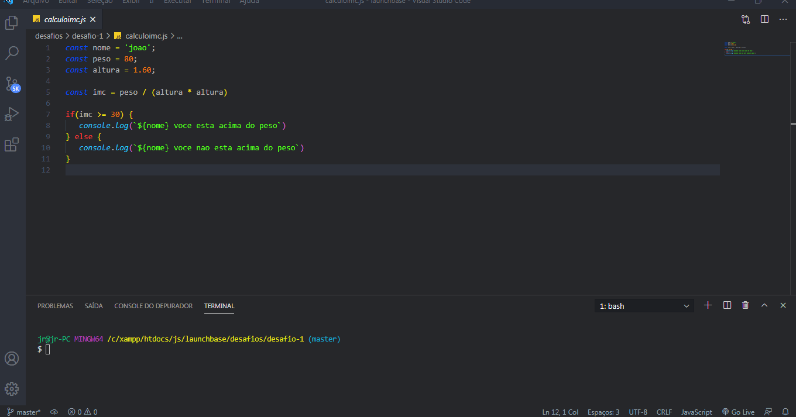
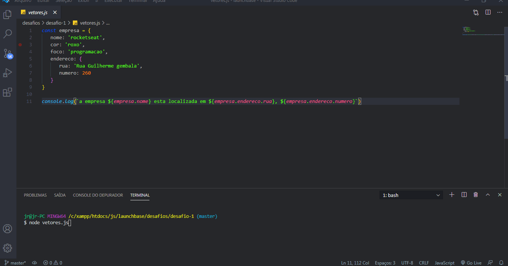
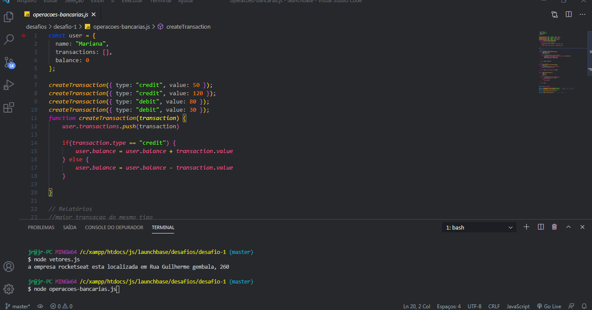

<h1 align="center">
    
</h1>   
 

## ℹ Sobre

Esses sao os primeiros desafios do launchbase onde sao propostos exercicios para serem resolvidos com oque foi apresentado nas aulas
 

 

 

 

 

## 🚀 Tecnologias utilizadas:

- Javascript

💬 Vamos trocar ideias 
------------------
[*Entre em contato comigo*](https://www.linkedin.com/in/ivo-pereira-3997911a8/)

Obrigado por chegar até aqui!

