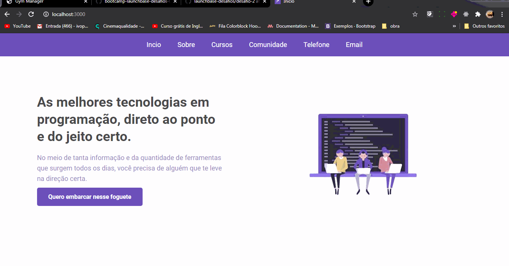

<h1 align="center">
    
</h1>   
 

## ℹ Sobre

<h3>Nexte desafio foi proposto para criar algumas paginas relacionadas a rocketseat foi colocado um iframe na parte de conteudos que puxa o conteudo relacionado ao curso selecionado e esses dados vem do site da rocketseat</h3>
 

 

## 🚀 Tecnologias utilizadas:

- Css
- html
- Javascript
- Node.js

💬 Vamos trocar ideias 
------------------
[*Entre em contato comigo*](https://www.linkedin.com/in/ivo-pereira-3997911a8/)

Obrigado por chegar até aqui!

