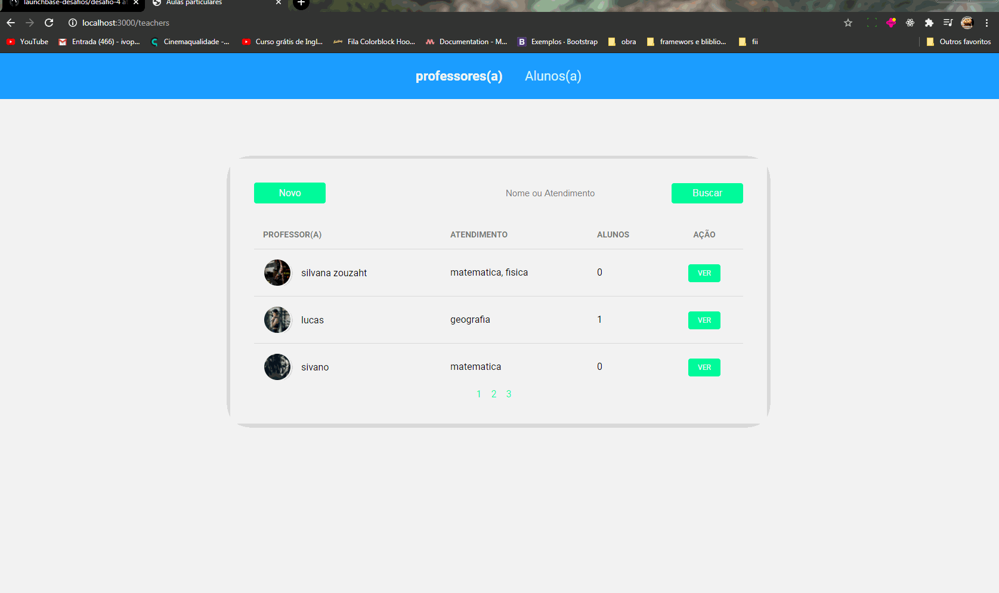

<h1 align="center">
    
</h1>   
 

## ℹ Sobre
Esse e um desafio do bootcamp aqui foi proposto para fazer uma aplicação onde e possivel cadastrar professores e estudantes e também editar os dados do cadastro e a opção de excluir o cadastro

E por fim foi aplicado um filtro para fazer buscas por nome, atendimento, email ou algo que prefira foi feita também a idéia de paginação limitando o numero de itens que vão aparecer e a continuação da paginação para quando mudar a page trazer novos itens e para manter o filtro de busca caso tenha

 
 

## 💻 Aplicação em Funcionamento

 
 

 
 

 
 

 
 

 
 

## 🚀 Tecnologias utilizadas:

- css
- Html
- Javascript
- Node.js
- Sql
- nunjucks
- postbird

💬 Vamos trocar ideias 
------------------
[*Entre em contato comigo*](https://www.linkedin.com/in/ivo-pereira-3997911a8/)

Obrigado por chegar até aqui!

